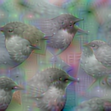
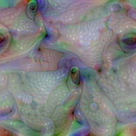
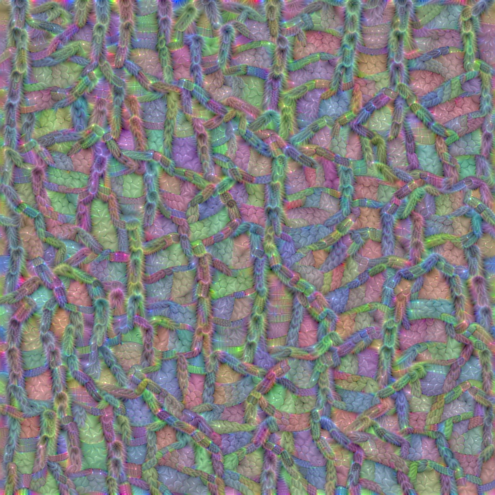
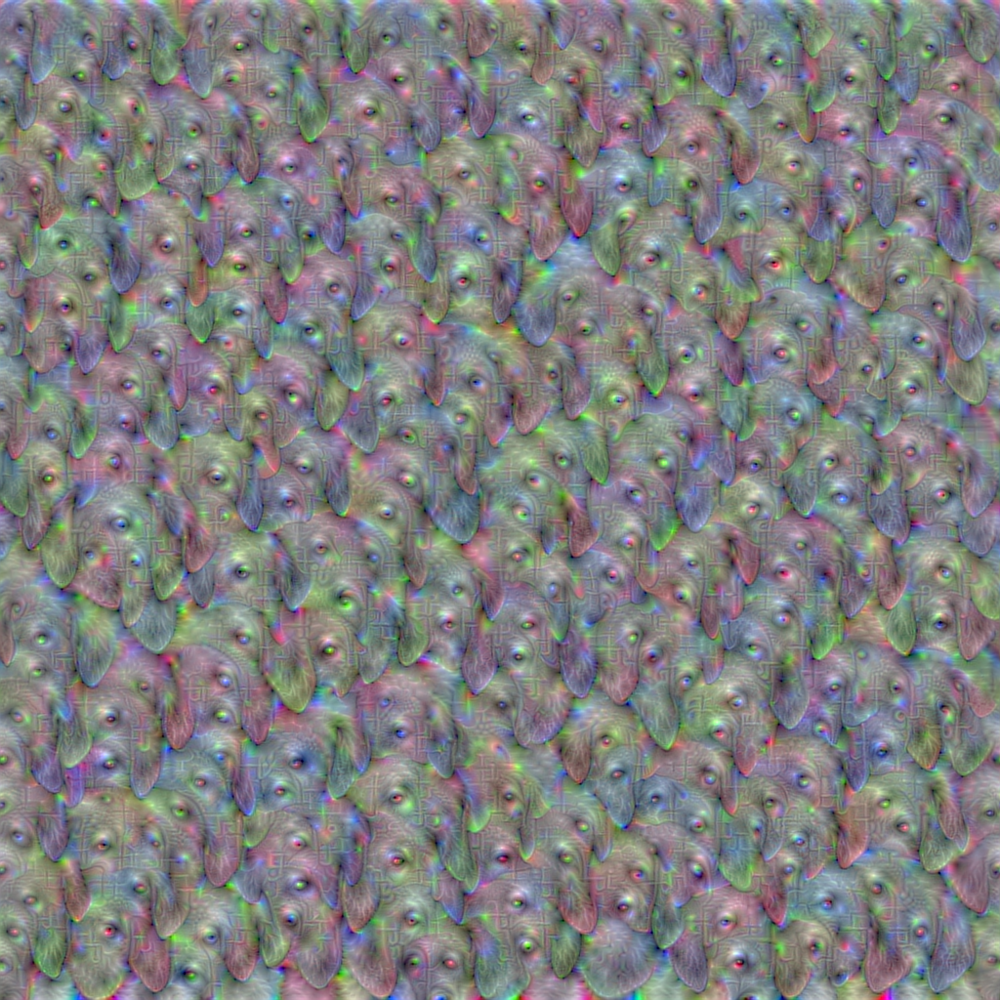

# FeatureVisualization
A module to generate feature visualisations for Keras models

**African Elephant:**

### VGG-16

**Ouzel:**

**Tree Frog:**

**Block 5 - Pooling - Filter 336**

**Block 5 - Pooling - Filter 351**

